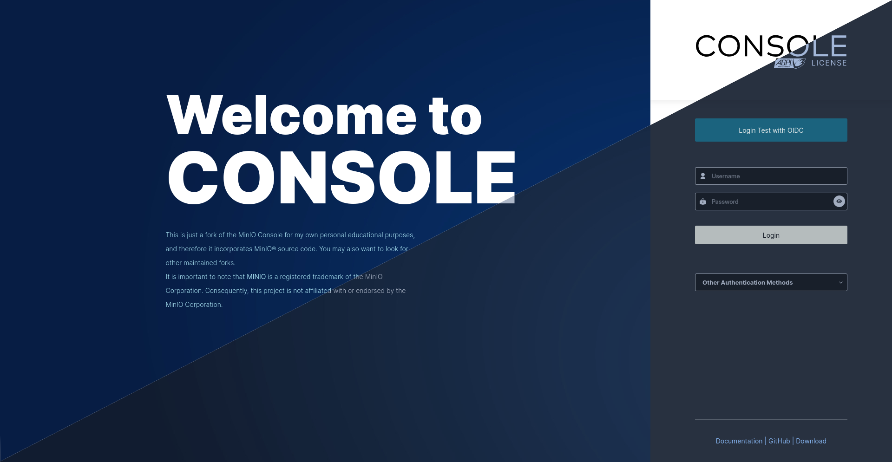
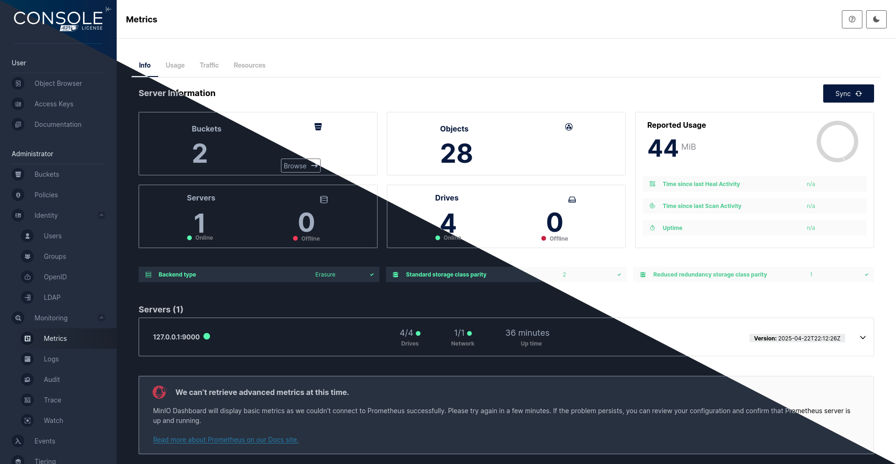
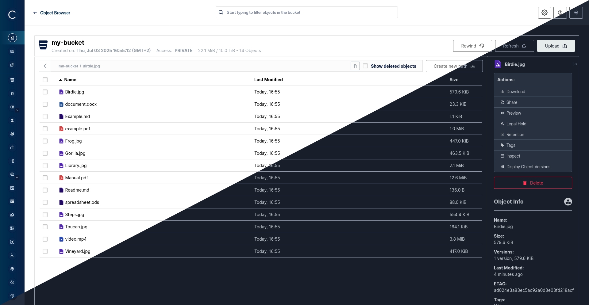
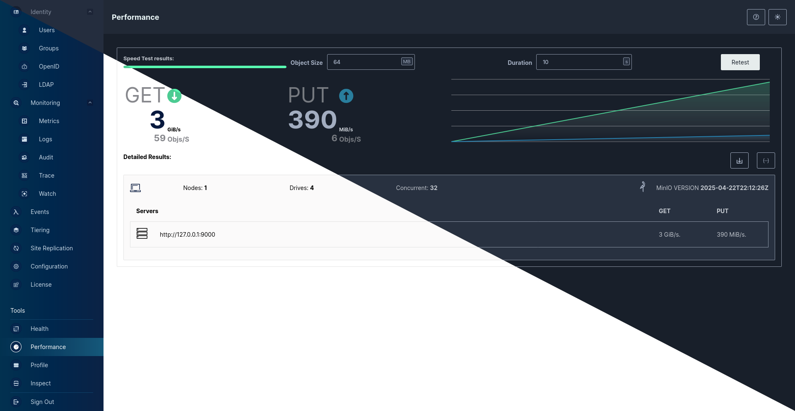
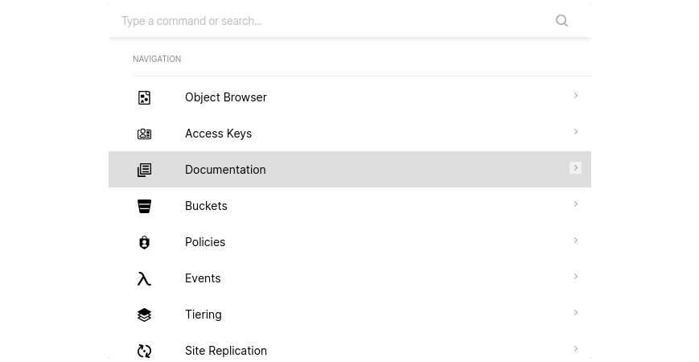

> [!NOTE]
> This is just a fork of the [MinIO Console](https://github.com/minio/object-browser) for my own personal educational purposes, and therefore it incorporates MinIO® source code. You may also want to look for other maintained [forks](https://github.com/minio/object-browser/forks).

> [!NOTE]
> It is important to note that **MINIO** is a registered trademark of the MinIO Corporation. Consequently, this project is not affiliated with or endorsed by the MinIO Corporation.

# Console

 

A graphical admin management browser user interface for [MinIO® Server](https://github.com/minio/minio)

| Login                                    | Metrics                                             | Object Browser                         |
|------------------------------------------|-----------------------------------------------------|----------------------------------------|
|              |                     |  |
|  |  |                                        |
| **Performance/ Speedtest**               | **<kbd>Ctrl</kbd>/<kbd>Strg</kbd> + <kbd>k</kbd>**  |                                        |

<!-- markdown-toc start - Don't edit this section. Run M-x markdown-toc-refresh-toc -->
**Table of Contents**

- [Console](#console)
  - [Install](#install)
    - [Binary Releases](#binary-releases)
    - [Docker](#docker)
    - [Build from source](#build-from-source)
  - [Setup](#setup)
    - [1. Create a user `console` using `mc`](#1-create-a-user-console-using-mc)
    - [2. Create a policy for `console` with admin access to all resources (for testing)](#2-create-a-policy-for-console-with-admin-access-to-all-resources-for-testing)
    - [3. Set the policy for the new `console` user](#3-set-the-policy-for-the-new-console-user)
  - [Start Console service:](#start-console-service)
- [Documentation](#documentation)
- [Contribute to Console Project](#contribute-to-console-project)
- [License](#license)

<!-- markdown-toc end -->
## Install

### Binary Releases 
|   OS    |  ARCH   |                                                Binary                                                       |
|:-------:|:-------:|:-----------------------------------------------------------------------------------------------------------:|
|  Linux  |  amd64  |     [linux-amd64](https://github.com/georgmangold/console/releases/latest/download/console-linux-amd64)     |
|  Linux  |  arm64  |     [linux-arm64](https://github.com/georgmangold/console/releases/latest/download/console-linux-arm64)     |
|  Linux  |   arm   |       [linux-arm](https://github.com/georgmangold/console/releases/latest/download/console-linux-arm)       |
|  Apple  |  amd64  |    [darwin-amd64](https://github.com/georgmangold/console/releases/latest/download/console-darwin-amd64)    |
|  Apple  |  arm64  |    [darwin-amd64](https://github.com/georgmangold/console/releases/latest/download/console-darwin-arm64)    |
| Windows |  amd64  | [windows-amd64](https://github.com/georgmangold/console/releases/latest/download/console-windows-amd64.exe) |

### Docker
Pull the latest release via: [Github Packages](https://github.com/georgmangold/console/pkgs/container/console)
```
docker pull ghcr.io/georgmangold/console
```
Run it with and replace `YOUR_MINIO_SERVER_URL` with your own MinIO Server URL
```
docker run -p 127.0.0.1:9090:9090 -e CONSOLE_MINIO_SERVER=https://YOUR_MINIO_SERVER_URL ghcr.io/georgmangold/console
```

### Build from source
> [!NOTE]
> You will need a working Go environment. Therefore, please follow [How to install Go](https://golang.org/doc/install).
> Minimum version required is 

```
go install github.com/georgmangold/console/cmd/console@latest
```
Refer to [DEVELOPMENT.md](DEVELOPMENT.md) and [CONTRIBUTING.md](CONTRIBUTING.md) for more Information on how to build this project.

## Setup

All `console` needs is a MinIO user with admin privileges and URL pointing to your MinIO deployment.

> [!NOTE]
> We don't recommend using MinIO's Root Admin Credentials

### 1. Create a user `console` using `mc`

```bash
mc admin user add myminio/
Enter Access Key: console
Enter Secret Key: xxxxxxxx
```

### 2. Create a policy for `console` with admin access to all resources (for testing)

```sh
cat > admin.json << EOF
{
	"Version": "2012-10-17",
	"Statement": [{
			"Action": [
				"admin:*"
			],
			"Effect": "Allow",
			"Sid": ""
		},
		{
			"Action": [
                "s3:*"
			],
			"Effect": "Allow",
			"Resource": [
				"arn:aws:s3:::*"
			],
			"Sid": ""
		}
	]
}
EOF
```

```sh
mc admin policy create myminio/ consoleAdmin admin.json
```

### 3. Set the policy for the new `console` user

```sh
mc admin policy attach myminio consoleAdmin --user=console
```

> [!NOTE]
> Additionally, you can create policies to limit the privileges for other `console` users, for example, if you
> want the user to only have access to dashboard, buckets, notifications and watch page, the policy should look like
> this:
> ```json
> {
>   "Version": "2012-10-17",
>   "Statement": [
>     {
>       "Action": [
> 	"admin:ServerInfo"
>       ],
>       "Effect": "Allow",
>       "Sid": ""
>     },
>     {
>       "Action": [
> 	"s3:ListenBucketNotification",
> 	"s3:PutBucketNotification",
> 	"s3:GetBucketNotification",
> 	"s3:ListMultipartUploadParts",
> 	"s3:ListBucketMultipartUploads",
> 	"s3:ListBucket",
> 	"s3:HeadBucket",
> 	"s3:GetObject",
> 	"s3:GetBucketLocation",
> 	"s3:AbortMultipartUpload",
> 	"s3:CreateBucket",
> 	"s3:PutObject",
> 	"s3:DeleteObject",
> 	"s3:DeleteBucket",
> 	"s3:PutBucketPolicy",
> 	"s3:DeleteBucketPolicy",
> 	"s3:GetBucketPolicy"
>       ],
>       "Effect": "Allow",
>       "Resource": [
> 	"arn:aws:s3:::*"
>       ],
>       "Sid": ""
>     }
>   ]
> }
> ```

## Start Console service:

Before running console service, following environment settings must be supplied

```sh
# MinIO Endpoint
export CONSOLE_MINIO_SERVER=http://localhost:9000
```

Now start the console service.

```
./console server
2021-01-19 02:36:08.893735 I | 2021/01/19 02:36:08 server.go:129: Serving console at http://localhost:9090
```

By default `console` runs on port `9090` this can be changed with `--port` of your choice.

> [!NOTE]
> If you have changed the region on your MinIO Server from the default `us-east-1` you need to set the Environment Variable `CONSOLE_MINIO_REGION=` as well.

## Documentation

See [documentation](docs/README.md) for more information.

## Contribute to console Project

Please follow console [Contributor's Guide](./CONTRIBUTING.md)


## License

- Console is licensed under the [GNU AGPLv3](LICENSE).