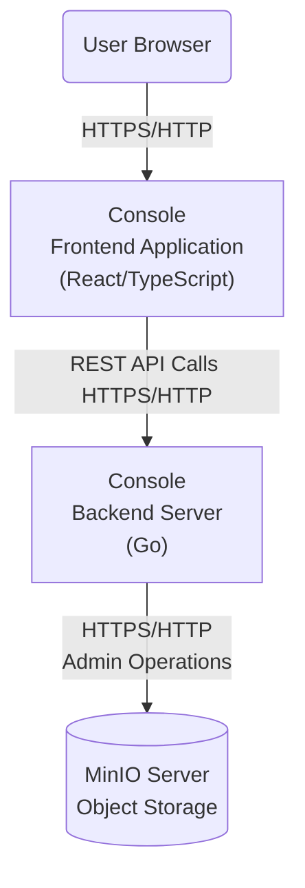

# Console Frontend WebApp

This Folder contains the Web Frontend for Console using React/TypeScript.



Also refer to [DEVELOPMENT.md](../DEVELOPMENT.md) and [CONTRIBUTING.md](../CONTRIBUTING.md) for more Information on how to build this whole project.

This project was bootstrapped with [Create React App](https://github.com/facebook/create-react-app) now using [Vite](https://vite.dev/) to build.

Requirements: `yarn` and [node](https://nodejs.org/en/download)

## Available Scripts

In the `/web-app` directory, you can run:

### `yarn start`

Runs the app in the development mode. Needs Console local running in Dev Mode on Port 9090. <br />

```bash
CONSOLE_ACCESS_KEY=<your-access-key>
CONSOLE_SECRET_KEY=<your-secret-key>
CONSOLE_MINIO_SERVER=<minio-server-endpoint>
CONSOLE_DEV_MODE=on
./console server
```

Opens [http://localhost:5005](http://localhost:5005) to view it in the browser.

The page will reload if you make edits.<br />
You will also see any lint errors in the console.

> [!NOTE]
> If it's the first time running `yarn`, you might need to run `yarn install` before the `start` command.

### `yarn build` or `make build-static`

Builds the app for production to the `build` folder.<br />
It correctly bundles React in production mode and optimizes the build for the best performance.

Your app is ready to be deployed!

> [!IMPORTANT]
> Don´t commit and push changes in the `build` folder if its not a release. Discard this changes.

### `yarn vitebuild`

Fast build without typechecking during development.

### `yarn typecheck`

Runs typescript `tsc` to check for type errors.

### `yarn tscwatch`

Runs typescript `tsc` in watch mode `--watch`

### `yarn preview`

Preview the bundled output in the `build` folder with an Webserver.

### `make test-warnings`:

Runs ./check-warnings.sh builds and looks for warnings during build.

### `make test-prettier`:

Runs ./check-prettier.sh and checks formating with prettier.

### `make find-deadcode`:

Runs ./check-deadcode.sh using knip.

### `make pretty`:

Runs prettier with `yarn prettier --write . --log-level warn`.

## Learn More

You can learn more in
the [Vite documentation](https://vite.dev/guide/).

To learn React, check out the [React documentation](https://react.dev/).
